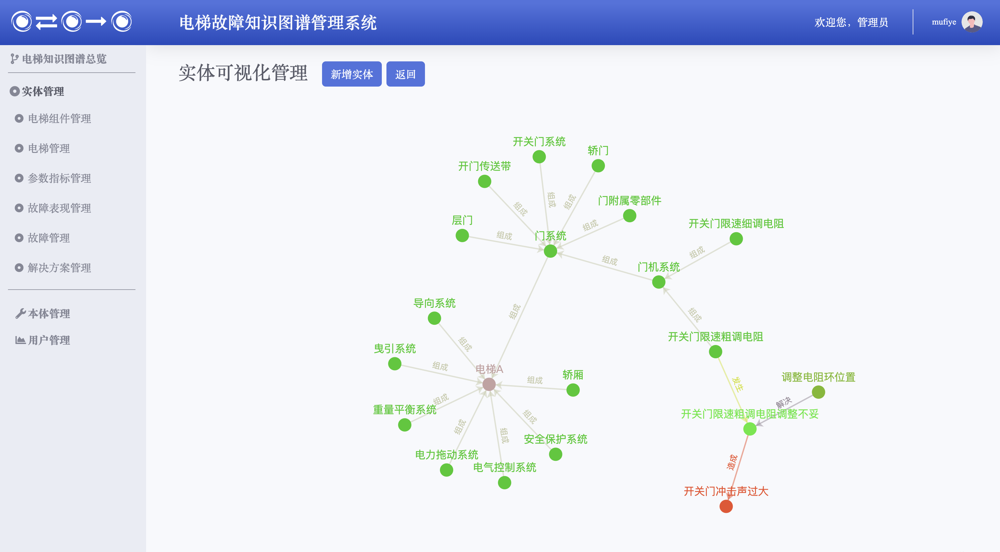
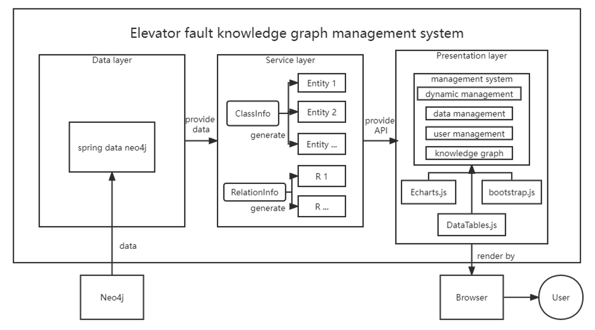

# KG-System

该系统实现了知识图谱的**本体管理**（ontology management）、**实体管理**（entity management）和**可视化管理**（visualization management），同时拓展了用户管理的功能（user management）和服务管理（service management）。其可以用于科研人员更快速高效地进行知识图谱管理甚至于对相关的人员和服务进行管理，将知识图谱应用到具体的科研问题中（如本系统最初的需求：电梯故障知识），当然我相信其可以被更多的知识图谱研究项目使用，因为其后端是基于抽象的知识图谱实体和关系进行构建的。
前端在[mufiye_KG-System-front](https://github.com/mufiye/mufiye_KG-System-front)目录下.
## 项目展示

这是系统中将电梯故障相关的实体以及实体关系进行可视化后的结果，更多系统展示的图片在demo_img目录下。

## 架构分析

* 前端使用Vue2，Echart，Bootstrap
* 后端使用**SpringBoot**，**Spring MVC**，**Spring Data**
* 数据库使用neo4j这个图数据库

## 业务分析

* 知识图谱模块：
  * 本体管理（可以理解为**实体的类型**和**实体之间允许出现的关系**）
  * 实体管理（也就是**具体的实体**，比如电梯组件是实体类型，具体的电梯组件有电气控制系统、门系统、导向系统。上面的实体和本体管理都包含**对其属性的管理**）
  * 可视化管理（也就是具体的**实体关系**，如导向系统组成电梯A，开关门系统组成门系统）
* 服务监视模块：
  * 监视知识图谱系统占用的内存和Cpu负载
  * 监视当前图数据库中实体和关系数量
  * 监视当前用户的最近登录登出信息
* 用户模块：

  * 用户注册

  * 用户登录
  * 用户可以修改个人信息
  * 管理员可以对用户进行增删改查

## Pojo设计

* ClassInfo对应于**实体的类别**，如电梯组件
* Entity对应于**具体的实体**，如门系统这个电梯组件
* RelationInfo对应于**本体之间的关系**，可以理解为**实体间允许的类别**
* Relation对应于**实体之间的关系**
* User对应于用户
* ServiceInfo对应于具体的服务信息，如cpu负载、内存余量

